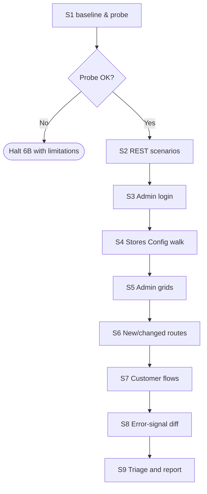

# Smoke Runner

How Phase 6B actually executes — environment probe, REST invocation, browser driving, and
graceful fallbacks. This file is the **only** source of truth for the smoke runner; do not
hardcode runner choices in `SKILL.md`.

---

## 1. Environment Probe (S1)

Run once at the start of Phase 6B. Record every result in `.docs/{FeatureName}/smoke/baseline.txt`.
Never assume a tool exists; degrade explicitly.

| Probe | How to detect | If missing |
|-------|---------------|------------|
| Base URL | `CLAUDE.md` line `Base URL:` → else `{magento} config:show web/secure/base_url` → else ask | Halt 6B with "no base URL — smoke cannot run". |
| Admin URL fragment | `{runner} php -r "echo (require '{ctx.magento_root}/app/etc/env.php')['backend']['frontName'] ?? 'admin';"` (layout-aware path — bare `app/etc/env.php` is wrong in a `src/` layout) | Default `/admin` and warn. Pass it to the browser driver as `--admin-path=/<frontName>`. |
| Admin user | `CLAUDE.md` line `Smoke admin user:` → else env `M2_SMOKE_ADMIN_USER` → else prompt once | Halt S3 only; other suites continue. |
| Admin password | env `M2_SMOKE_ADMIN_PASS` → else prompt once (echo suppressed). **Do NOT read the password from `CLAUDE.md`** — that file is committed; a password there leaks into version control. (A `Smoke admin pass:` line in CLAUDE.md, if present, must be ignored and the user warned.) | Halt S3 only. |
| HTTP client | `{ctx.tools.curl}` (resolved by `magento2-context`) → fallback `{runner} php -r "echo function_exists('curl_init') ? 'php' : 'no';"` | Skip S2; record explicit limitation. |
| Headless browser | `{ctx.tools.headless_browser}` (resolved by `magento2-context`) | **Not an error.** Sets `browser_policy = curl-only`; S3–S7 run the degraded curl tier (§3.1). |
| Node | `node --version` | Skip browser-dependent suites. |
| jq | `jq --version` | Optional — fall back to raw JSON in report. |

`${CLAUDE_SKILL_DIR}/scripts/smoke-browser.mjs` implements the Playwright → Puppeteer →
`google-chrome` ladder itself and picks the first available at startup; the probe above only
records **which** one context resolved, so the run report is honest about what drove the browser
suites.

### Production guard

After resolving `Base URL`, run the production heuristic from `smoke-test-guide.md` §Data Hygiene.
If the URL looks like production AND `CLAUDE.md` does **not** contain
`Allow smoke on production: true`, halt 6B with:

> Base URL `{url}` looks like production. Smoke runs create and delete data; refusing to run.
> To override, add `Allow smoke on production: true` to CLAUDE.md.

### 1.1 Browser policy for this run

Resolve `browser_policy` (`auto` | `curl-only`) before S2. The precedence table, the exact
prompt phrasings that select `curl-only`, and the rule against caching the value are defined
once in `magento2-context/references/runtime-test-tooling.md` — do not restate them here.

Record the outcome in `baseline.txt` and in the run report:

```
browser_policy: curl-only
reason: prompt directive ("do not use browser")
```

Under `curl-only`:

- S2 (REST) and S8 (error signals) run **in full** — they never used a browser.
- S3–S7 run the degraded curl tier (§3.1) instead of `smoke-browser.mjs`.
- S9 must emit the mandatory Medium `coverage` finding defined by the shared policy.

`auto` is the only other value; there is no way to force a browser for REST (Rule 1 of the
shared policy is absolute).

---

## 2. REST Invocation (S2)

For each REST scenario in `scenarios.md`, the runner:

1. Resolves an auth token according to the scenario's `Auth` column:
   - `admin token` → POST `/V1/integration/admin/token` with admin user/pass; cache token for the run.
   - `customer token` → POST `/V1/integration/customer/token` with the throwaway customer
     created in S7. If S7 has not run yet, create the customer inline as part of S2 prep.
   - `none` → no Authorization header.
   - `wrong ACL` → use the customer token (or an integration token with no admin ACL).
2. Builds the request: method + URL (`{base}/rest{route}`) + body (read from scenarios.md sample).
3. Executes via `curl --silent --show-error --include` (or PHP cURL fallback).
4. Parses status line and body; matches against the scenario's `Expect status` + `Expect body match`
   (the latter is a JSONPath-style expression; jq is preferred when available, regex fallback otherwise).
5. Writes the actual status into the `Actual` column and pass/fail into the `Pass` column.
6. Stores the raw request/response under `smoke/raw/S2/{scenario-id}.txt` so failures are debuggable.

Auth tokens are stored only in memory; never written to baseline.txt or any file.

---

## 3. Browser Driving (S3–S7)

The runner uses `${CLAUDE_SKILL_DIR}/scripts/smoke-browser.mjs` — a thin wrapper around Playwright/Puppeteer.
It exposes one command per suite step:

```bash
node scripts/smoke-browser.mjs <command> [options]
```

Auth is cookie-file based (there is no `--token` flag): `admin-login` saves the session
cookies with `--save-cookies=<file>`, and the S4–S6 commands re-load them via
`--admin-cookie-file=<file>`. Pass `--admin-path=/<frontName>` when the admin uses a custom
front name.

| Command | Purpose | Output |
|---------|---------|--------|
| `admin-login --url=…/admin --user=… --pass=… --save-cookies=admin.json` | Drive S3 + save session | `{ ok, status, adminPath, cookiesSaved, consoleErrors[] }` |
| `stores-config-walk --url=… --admin-cookie-file=admin.json --sections=a/b/c,d/e/f` | Drive S4 (loads sections; no field write) | per-section status |
| `grid --url=… --admin-cookie-file=admin.json --route=/{admin}/customer/index/index --filter='name:Smith'` | Drive S5 per grid | row count, `filterApplied` (no clear) |
| `visit --url=… --route=/path --click=#cta --screenshot=out.png` | Drive S6 per route | render status, console errors |
| `customer-flow --url=… --email=smoke+{uuid}@example.test --pass=…` | Drive S7 | each step result |
| `cleanup --url=… --admin-cookie-file=admin.json --customer-email=…` | S9 cleanup (navigates to grid; `deleted:false`) | best-effort note |

The wrapper:

- Captures `page.on('console')` errors (`error` and `pageerror` only — `warn`/`info` ignored).
- Captures any HTTP response with status >= 500 as a Critical finding.
- Captures uncaught JS exceptions as High findings.
- Saves a screenshot per command to `smoke/screenshots/run-{N}/{slug}.png`.
- Times out at 30s per page navigation; surfaces a finding rather than retrying silently.

### Tool selection at startup

```
if (npx playwright is available)        → Playwright (chromium, headless)
else if (npx puppeteer is available)    → Puppeteer
else                                    → exit 78 (unavailable)
```

Exit codes: `0` = pass, `1` = at least one finding, `78` = tool unavailable.

An exit `78` — or a run where `browser_policy == curl-only` before the script is even reached —
does **not** skip S3–S7. It routes them to §3.1.

### 3.1 Degraded curl tier (S3–S7 without a browser)

Used whenever `browser_policy == curl-only`. What it asserts, what it deliberately does not
attempt, and the mandatory Medium `coverage` finding are defined in
`magento2-context/references/runtime-test-tooling.md` §Rule 5. The per-suite mapping:

| Suite | Under `auto` | Under `curl-only` |
|-------|--------------|-------------------|
| S3 Admin login | `admin-login` drives the form, asserts dashboard + no console error | `curl -s -o /dev/null -w '%{http_code}' "{base}/{adminPath}"` → expect 302 or 200. **No authentication attempted** (form key + mandatory 2FA). |
| S4 Stores → Configuration | walks each new/changed section | **Not covered** — needs an admin session. Named in the coverage finding. |
| S5 Admin grids | loads each grid, applies a filter | **Not covered** — needs an admin session. Named in the coverage finding. |
| S6 New / changed routes | render + click CTA + console errors | per admin route: expect 302 to login (proves registered, not 404/500). Per frontend route: expect non-5xx, plus the route's expected-marker grep when the task recorded one. |
| S7 Customer storefront flows | registers a throwaway customer, logs in, walks My Account | REST customer-token scenarios in S2 already prove auth works. Storefront pages: `GET` each, expect non-5xx. JS-driven cart and checkout are **not covered**. |

Example, per route:

```bash
curl -s -o /dev/null -w '%{http_code}\n' -A 'magento2-smoke' "{base_url}{route}"
```

Store each raw response under `smoke/raw/S{n}/{slug}.txt` exactly as the browser tier stores
screenshots, so a failure is debuggable from the artefacts alone.

A 5xx here is **Critical**, identical to the browser tier — the tier is degraded in coverage,
not in severity. No screenshots are produced; the run report's screenshot section says
`none — curl tier` rather than being omitted.

---

## 4. Error-Signal Diff (S8)

Implemented by `${CLAUDE_SKILL_DIR}/scripts/smoke-baseline.sh` (S1) and
`${CLAUDE_SKILL_DIR}/scripts/smoke-tail-since.sh` (S8). Three signal sources — `exception.log`,
every other `var/log/*.log`, and `var/report/**` — because Magento writes failures to all three
and two of them never touch `exception.log`. Full mechanics, level policy, attribution rules and
exit codes: `error-signal-baseline.md`. Do not re-derive them here.

```bash
# S1 — capture. Second arg is {ctx.magento_root}; omit to auto-resolve.
scripts/smoke-baseline.sh .docs/{FeatureName}/smoke/baseline.txt {ctx.magento_root}

# S8 — diff. --namespace takes every module the feature owns (comma-separated); it is what
# separates "the feature broke this" (Critical, gating) from background noise (Medium, recorded).
scripts/smoke-tail-since.sh \
    .docs/{FeatureName}/smoke/baseline.txt \
    .docs/{FeatureName}/smoke/raw/S8/exception-diff.log \
    --json=.docs/{FeatureName}/smoke/raw/S8/signals.json \
    --namespace={Vendor}_{Module}[,{Vendor}_{Other}] \
    --surfaces=cron,queue \
    --allowlist=.docs/{FeatureName}/smoke/allowlist.txt
```

Artefacts: `exception-diff.log` (unchanged legacy path), `logs/{name}.diff` per other log that
grew, `reports/{name}.json` per new/refreshed report file, and `signals.json` — the file S9
reads. Every finding in `signals.json` carries `severity`, `gating`, `category`, `attributed`,
`occurrences` and a stable `signature`; S9 copies them into `findings.md` keyed by that signature.

Exit codes drive the iteration verdict: `1` = gating signal, 6B fails · `4` = non-gating signals
only, iteration may pass · `0` = clean · `5` = **degraded scan** (python3 missing or a
pre-manifest baseline): only `exception.log` was checked, so record a Medium coverage finding and
say so in the run report — a `5` is not a pass.

Before S8, write the `Smoke exception ignore:` patterns from `CLAUDE.md` to
`smoke/allowlist.txt` (one PCRE per line) so the run is reproducible from its own artefacts.

The baseline file persists across iterations within the same run, so iteration 2's S8 still
diffs against iteration 1's S1 baseline — i.e. signals created by iteration 1's fix attempts are
not "forgiven". This is intentional; `findings.md` carries the resolved/unresolved memory.

---

## 5. Runner Composition



Suites S2–S7 run sequentially (not parallel) — they share auth state and would race on the
error-signal baseline. Within a suite, individual scenarios may parallelise as long as the
runner script supports it; the default browser wrapper runs serially for predictability.

---

## 6. Failure handling inside the runner

The runner does **not** retry on its own. A first failure is recorded and the next suite continues
so the user sees the full damage in one report. The skill — not the runner — decides whether the
overall iteration is a pass.

Two exceptions:

- Auth token requests in S2 may retry once on network timeout (Magento token endpoints are
  occasionally slow on cold start).
- Browser navigation may retry once on `net::ERR_CONNECTION_REFUSED` after a 5s wait (gives a
  just-deployed PHP-FPM time to warm up).

Both retries are logged in the run report so a flaky environment is visible.
